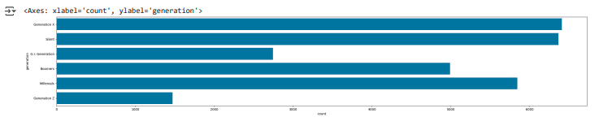
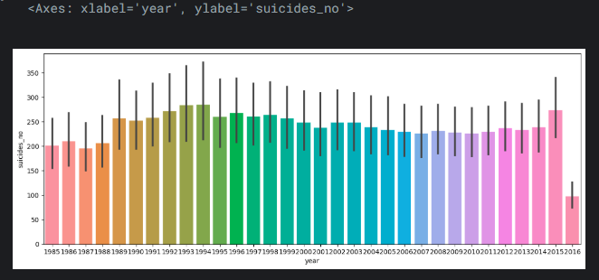
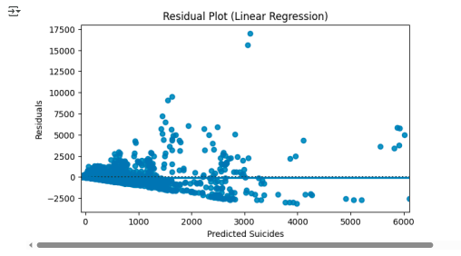
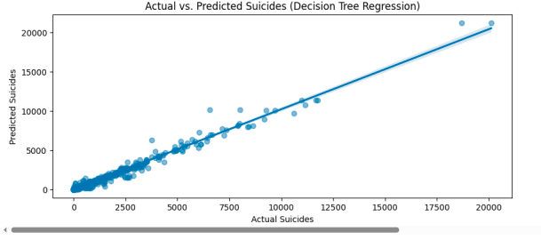
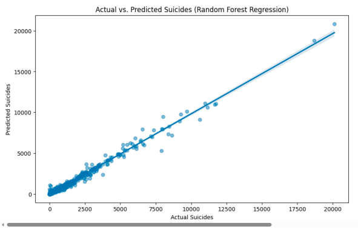
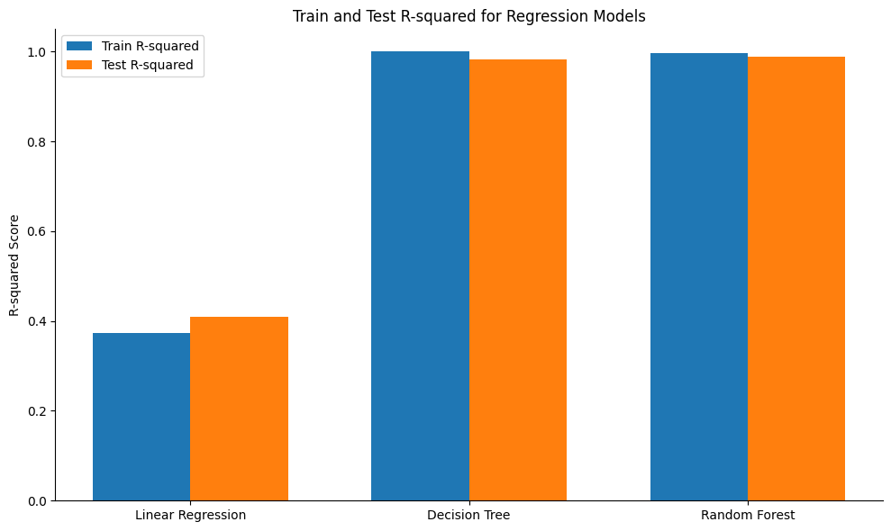

# Suicide Rate Analysis, Visualization, & Predictive Modeling

This repository presents a comprehensive data science project focused on understanding and predicting global suicide rates. It encompasses detailed exploratory data analysis, insightful visualizations, and the application of various machine learning models to identify patterns and forecast suicide numbers.

## 📊 Project Overview

This project delves into a historical dataset of global suicide rates to uncover underlying trends and develop predictive capabilities. It serves as a strong demonstration of an end-to-end data science workflow, from data preparation and exploratory analysis to advanced machine learning modeling and evaluation.

## 🎯 Objectives

* **Dataset Understanding & Preparation**: Gain a deep understanding of the suicide rate dataset (covering demographics, socio-economic factors, etc.) and prepare it for analysis.
* **Exploratory Data Analysis (EDA)**: Identify key trends, patterns, and correlations within the data through statistical analysis and compelling visualizations.
* **Predictive Modeling**: Develop and evaluate machine learning models capable of predicting suicide numbers based on relevant features.
* **Performance Evaluation**: Rigorously assess the performance of implemented models using appropriate metrics.
* **Insight Generation**: Derive actionable insights into factors influencing suicide rates globally.

## 🗃️ Dataset

The project utilizes a comprehensive dataset on global suicide rates spanning from 1985 to 2016. It includes variables such as country, year, age group, sex, population, GDP per capita, and Human Development Index (HDI).

* **Dataset File**: `SuicideData.csv`

## 🛠️ Methodology & Analysis Steps

The project followed a structured data science methodology:

1.  **Data Loading & Initial Exploration**: Loaded the dataset into a suitable analytical environment (e.g., Pandas DataFrame in Python). Performed initial checks for data types, missing values, and unique entries to understand the dataset's structure and quality.
2.  **Data Cleaning & Preprocessing**: Handled missing values, standardized data formats, and performed necessary transformations to prepare the data for analysis and modeling.
3.  **Exploratory Data Analysis (EDA)**: Conducted in-depth statistical analysis and generated various visualizations to explore relationships, distributions, and trends.
5.  **Predictive Modeling**: Applied various machine learning algorithms suitable for regression tasks to predict suicide numbers.
6.  **Model Evaluation**: Assessed the performance and robustness of the trained models using appropriate metrics.

## 📈 Key Findings & Visualizations

During the Exploratory Data Analysis phase, several critical trends and patterns were identified, visualized to provide clear insights:

### Demographic Analysis
* **Suicide Rate Between Generations:**
    
    *This chart illustrates how suicide rates vary across different generational cohorts.*

* **Compare Suicide Rate Between Both Genders:**
   
    *This visualization compares suicide rates between male and female populations, highlighting gender-specific patterns.*

### Temporal and Quantitative Trends
* **Trends Between Year and Suicide Numbers:**
    
    *This plot shows the evolution of suicide numbers over the years, revealing overall temporal trends.*

---

## 🤖 Machine Learning Models & Evaluation

The project deployed several machine learning models to predict suicide numbers, followed by a rigorous evaluation of their performance.

### Regression Models (Actual vs. Predicted)
* **Linear Regression Performance:**
    
    *This visualization displays the actual vs. predicted values from the Linear Regression model.*

* **Decision Tree Regression Performance:**
    
    *This chart compares the actual and predicted suicide numbers as determined by the Decision Tree Regression model.*

* **Random Forest Regression Performance:**
    
    *This plot shows the actual vs. predicted values for the Random Forest Regression model, often demonstrating higher accuracy.*

### Model Evaluation Metrics
* **R-squared for Generations (Regression Models):**
    
    *This chart presents the R-squared values across different regression models or for specific generations, indicating the proportion of variance in the dependent variable that is predictable from the independent variables.*

---

## 💻 Technologies Used

* **Python**: Core programming language.
* **Pandas**: For data manipulation and analysis.
* **NumPy**: For numerical operations.
* **Scikit-learn (sklearn)**: For implementing machine learning algorithms (Linear Regression, Decision Tree Regression, Random Forest Regression, K-Means Clustering, Logistic Regression - *you can add specific models if you used them beyond the ones in the visuals*).
* **Matplotlib / Seaborn**: For creating comprehensive data visualizations.
* **Jupyter Notebook**: For interactive analysis and code execution.

## 🚀 Conclusion

This project successfully demonstrates a full data science pipeline, from understanding raw data to deploying and evaluating predictive models for complex societal issues like suicide rates. The insights gained and the predictive capabilities developed can serve as a foundation for further research or public health initiatives.

---
